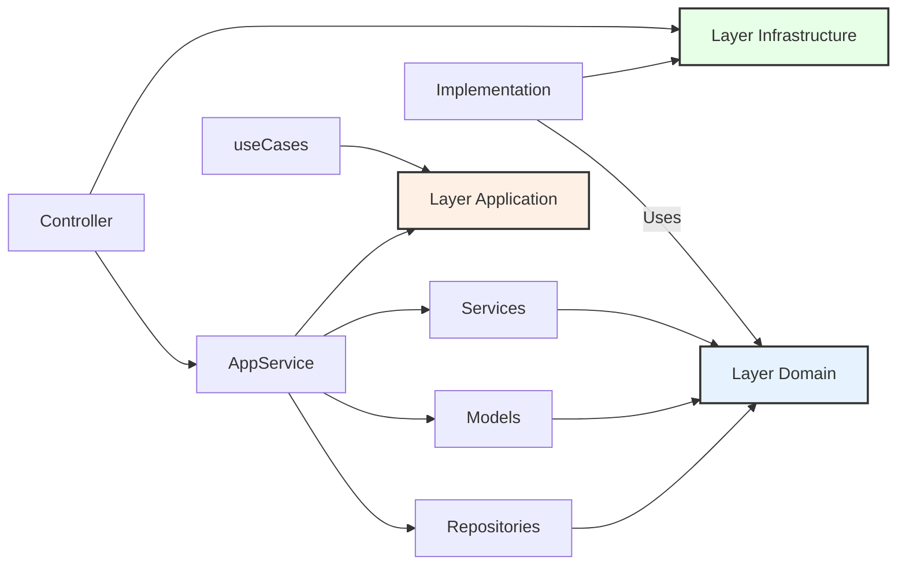

# Arquitectura de Software

- Reglas autoimpuestas para definir como diseñamos software
- Macro vs Micro diseño atacamos doe partes de la arquitectura a nivel de modelo o clase y un nivel mayor como la integraciones de los componentes.

## Que no es arquitectura de software?

- No es la arquitectura de hardware,

## Beneficios de la arquitectura hexagonal

- Mantenibilidad: Es mas fácil modificar o agregar features
- Cambiabilidad: Es mas fácil cambiar el comportamiento de la aplicación, bases da datos, servicios de correo etc
- Testeabilidad: Es mas fácil testear

## Que es la arquitectura hexagonal?

### Clean Architecture

- Reglas de dependencia de clean architecture: las capas solo pueden conocer a la capa mas cercana, la capa interna no conoce la externa , por lo que se puede cambiar sin afectar el core de la aplicación.

### Hexagonal Architecture o Puertos y adaptadores

#### Layers

- Domain: modelos , value objects, interfaces, service,
- Application: puto de entrada donde están los casos de uso
- Infrastructure: publicaciones de eventos, bases de datos, conexión a apis externas, librerías externas, etc, se definen por medio de interfaces a nivel de dominio.
- Infrastructure-> Application -> Domain

## Servicios de infraestructura

- Aquí usamos todas las librerías externas, como la base de datos, el servicio de correo, el servicio de notificaciones, etc.
- Debemos implementar las interfaces que definimos en el dominio.
- El dominio no se adapta a la librería, la librería se adapta al dominio.
- Los constructores de las clases de infraestructura solo implementa la interfaz, con su constructor pueden tener sus propias implementaciones. Por lo que varia de una implementación a otra.
- Cada particularidad de la implementación en su constructor no esta atada a la interfaz.

## La orquestaciones de servicios

- En el caso de nest se haría en la capa de infraestructura en el componente de modulo.

## Deferencias entre servicios de dominio y servicios de aplicación

### Aplicación

- Son los puntos de entrada a nuestra aplicación. Los controladores de línea de comandos o de nuestra API HTTP invocarán a los servicios de aplicación.
- Representan de forma atómica un caso de uso de nuestro sistema. En caso de modificaciones del estado de nuestra aplicación:
- Podrán hacer las de barrera transaccional con el sistema de persistencia.
- Publicarán los eventos de dominio respectivos.
- Coordinan las llamadas a los distintos elementos de nuestro sistema para ejecutar un determinado caso de uso.
- Les llamaremos indistintamente Servicio de Aplicación como caso de uso.

### Dominio

- Los servicios de domino representan una agrupación de lógica de negocio que podremos reutilizar desde múltiples Servicios de Aplicación.

- Vamos a poner un ejemplo para poder explicarnos mejor. Tenemos dos casos de uso en nuestra aplicación:

  - Obtener un vídeo en base a su identificador
  - Modificar el título de un determinado vídeo

En ambos casos de uso, necesitaremos la lógica de negocio para:

- Ir al repositorio de vídeos a buscar un vídeo determinado en base a su identificador
- Lanzar una excepción de dominio tipo VideoNotFound en caso de no encontrar el vídeo. Importante destacar que quien lanza esta excepción, como comentamos en el vídeo, no es la implementación del repositorio.
- Retornar el vídeo en caso de encontrarlo

Para evitar duplicar esta lógica de negocio en los 2 Servicios de Aplicación lo que solemos hacer es extraerla a un Servicio de Dominio que invocaremos desde ambos casos de uso.

_Es importante destacar que **los servicios de dominio en ningún caso publicarán los eventos de dominio que se puedan producir ni gestinonarán transacciones**. Eso se lo dejamos al Application Service que nos invoca para evitar duplicidades ya que es realmente él quién establece la “atomicidad” del caso de uso._

### Casos de uso o capa de aplicación en nest

- En este caso van a ser los services que estará usando el controlador?, y nuestra infraestructura serian nuestros providers a esos servicios de la capa de aplicación
- Recordar que también se va a hacer la inyección de dependencias a los repositorio en el la orquestación del modulo

## Errores

- Los errores personalizados deben ser creador por dominio
- Los que van a hacer un throw debe ser la capa de aplicación
- La traducción de esos errores a http, etc, debe ser la capa de presentación o en otras palabras mis controladores, el framework.
